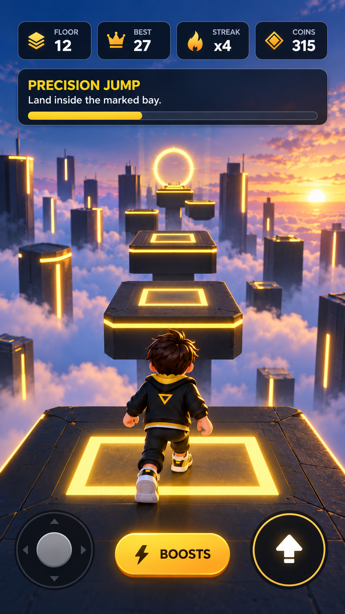

# Perfect Drop Art Direction

## Binding reference and corrected gameplay

The fourth user attachment remains the visual source for navy/gold architecture, sunset atmosphere and cloud-city depth. On 2026-10-07 the user explicitly corrected Perfect Drop to classic **tap-to-stack**, with 30 placements. The image's jumping character and controls are not the gameplay/UI specification.

## Palette and lighting

Deep navy #071426, panel navy #101C32, slate metal #313642, signal gold #FFC52E, highlight #FFE86A, dusk blue #315A98, cloud lavender #AFACC8, sunset peach #FFB97B, text #F7FAFF. Warm directional rim light with cool ambient fill must keep the top and sides of moving/settled blocks distinct. Gold glow must preserve visible edge boundaries.

## Materials and world design

Stacked blocks use beveled metal decks, a separate inset top plate and fine gold perimeter strips. Retained footprint and the falling cut-off piece must read clearly. Simple box collisions may exist internally; visible blocks are shaped meshes. The tower stands above soft cloud texture and layered distant skyline silhouettes. Environment art must not obscure the moving block. Final material/skyline/polish and physical mobile performance remain explicit acceptance gates.

User follow-up 2026-10-08: [PerfectDropIcon.png](../Assets/Art/PerfectDropIcon.png) is the additional block material reference. Standard blocks have dark metal shoulders, a bright inset gold plate with restrained brushed variation and a continuous lower gold band. The finish follows local UVs while the slab moves. Keep special pink/blue/green top cues and owned rail/body designs distinct. Share the existing mesh/materials and keep six renderers per block, including thin cut pieces; visual quality must be checked on actual native renders.

## Camera

An elevated three-quarter view shows overlap in both alternating axes. Smooth vertical tracking follows the settled tower, with enough framing to see the moving slab at both extremes. The player may orbit by dragging free space; yaw is never forced back behind a character. Tap and drag are distinct. Resize/rotation reflow UI and camera framing without recreating the tower or losing progress. Completion may frame the full tower without delaying Retry.

## Character design

No playable character is required for the confirmed stacking mechanic. Do not add the reference's runner, a helmet or jump animations to active gameplay.

## UI and typography

Four restrained navy stat cards show Stack/30, Best, Streak and Coins. The objective card explains stacking and displays immediate grading/progress. One large gold Drop control is the main action. Menu, settings, daily claim, miss/retry and completion are contextual. No joystick, jump or boost. Use bold clean sans-serif values and action labels, supporting DE/EN and long numeric/text cases. Text and every essential touch target must avoid active native reserved/division regions. Verify minimum 48 logical-point targets on actual device geometry rather than inferring them from reference-canvas pixels.

## Buttons and panels

Drop is a wide gold pill with dark text and immediate pressed feedback. Retry is prominent and responds immediately; no countdown or death animation blocks it. Settings pause the same moving-block phase and resume it when closed. Rounded navy panels preserve contrast over the sky/clouds. Dialogs may cover gameplay only in their appropriate modal state.

## VFX, audio and haptics

Perfect drops snap to alignment without shrinking, give a compact gold burst, explicit PERFECT text and a success cue. Good drops show the retained slab and the discarded overhang falling, with a lighter sound/haptic. Misses show an immediate result and reachable Retry. Keep bursts short and transparent overdraw limited. Include placement/perfect/miss/completion/UI cues plus quiet city ambience. Persist audio, haptic and reduced-motion preferences. Reduced motion removes nonessential rotation/bursts while retaining the required moving block and result information.

## Game feel and acceptance

Tap placement is immediate; a tiny duplicate-event guard must not become an animation lock. Difficulty increases through movement timing and shrinking area. Perfect streaks award coin bonuses. Exactly 30 placed layers complete a run; terminal taps cannot place layer 31 or duplicate rewards. Save settled layers and best/coins in the separate stacking profile.

Capture fresh portrait, wide portrait, landscape and official Duo open/divided layouts; verify contextual panels separately, unchanged state after resize, no tap from camera drag, readable cut geometry and visible placement feedback. Compilation alone is not visual acceptance. Physical iPhone/Android performance, haptic/audio feel and TestFlight smoke remain mandatory release gates.

## Arcade Builder additions
The level map, styles and city are contextual screens; hide gameplay HUD behind them. Opaque navy cards, warm gold primary actions and readable text preserve the reference palette. Moving special decks use gold (bonus), pink (fragile), blue (drift) and green (wind) plus textual labels. Three earned rail styles extend the palette. City districts use authored beveled stacked buildings on metal cloud platforms; star antennae reflect improved records. Disable the legacy skyline during the city view, fit buildings clear of navigation in portrait/landscape, and allow free-space camera drag. These Mac captures verify the current implementation, not final mobile concept quality.
